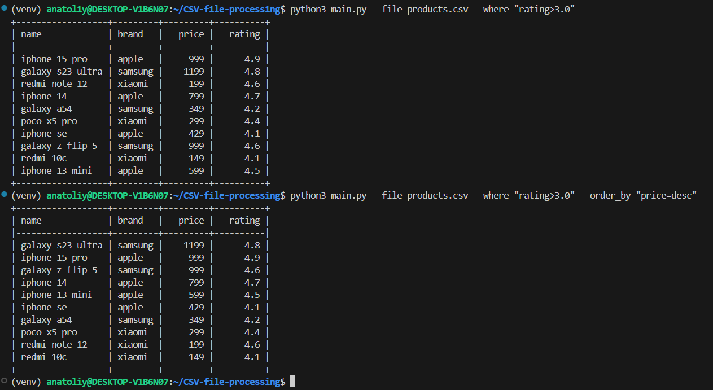

# Обработка csv файла


## Описание
Данный скрипт предназначен обработки файлов в формате CSV, который может фильтровать, сортировать и агрегировать данные.

#### Установить проект себе можно, прописав команды в командной строке:
- `git clone https://github.com/Anatoliy2610/Employee-salary-calculation-script.git`
- `make install` (установятся зависимости из файла requirements.txt)

## Как пользоваться
### Примеры запусков скрипта
- `python3 main.py --file tests/fixtures/file1.csv`
- `python3 main.py --file tests/fixtures/file1.csv --where "rating>4.7"`
- `python3 main.py --file tests/fixtures/file1.csv --where "brand=apple"`
- `python3 main.py --file tests/fixtures/file1.csv --aggregate "rating=avg"`
- `python3 main.py --file tests/fixtures/file1.csv --where "brand=xiaomi" --aggregate "rating=min"`
- `python3 main.py --file tests/fixtures/file1.csv --order_by "rating=asc"`
- `python3 main.py --file tests/fixtures/file1.csv --order_by "rating=desc"`
- `python3 main.py --file tests/fixtures/file1.csv --order_by "rating=asc" --where 'brand=xiaomi'`
Чтобы получить данные, необходимо обязательно указать файл `--file tests/fixtures/file1.csv`
Отфильтровать данные можно при помощи `--where` и `"brand=apple"`, `"brand!=apple"`, `"brand=xiaomi"` и т.д.
Агрегировать числовые данные можно при помощи `--aggregate` и `"rating=avg"`, `"rating=min"`, `"price=max"`
Сортировать данные можно при помощи `--order_by` и `"rating=desc"` или `"rating=asc"`

### Пример структуры файла CSV
Формат файла должен быть следующим:
```
name,brand,price,rating
iphone 15 pro,apple,999,4.9
galaxy s23 ultra,samsung,1199,4.8
redmi note 12,xiaomi,199,4.6
poco x5 pro,xiaomi,299,4.4
```

#### Запустить проверки проекта можно, прописав команды в командной строке:
- `make test` (запускает тестирование)
- `make check` (запускает проверку линтера)
- `make format` (исправляет ошибки линтера)
- `isort processing_CSV` (исправляет импорты, вместо main.py можно указать другой файл, либо директорию)


## Примеры запуска приложения

